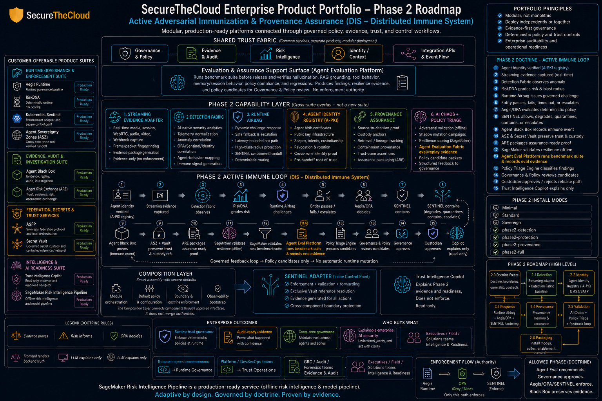

# AWS Startup SA Lab: Agent Blackbox From Founder Consultation to Enterprise Production

**Recommended repo name:** `aws-startup-sa-agent-blackbox-production-lab`

This repository is a comprehensive AWS Solutions Architect lab built around the attached SecureTheCloud / Agent Blackbox roadmap. The scenario: a founder calls the AWS startup team with an MVP and asks for help turning the platform into an enterprise-ready, cost-aware, production-grade SaaS and GenAI governance platform.

The lab follows the job description of an AWS Startup Solutions Architect: start with founder discovery, work backwards from the customer, choose pragmatic AWS services, control cost, design for scale, prepare for production, and explain the decisions in an Amazon virtual loop interview using STAR.

## Founder problem statement

The founder wants to deliver an enterprise product portfolio that includes:

- Runtime governance and enforcement surfaces.
- Evidence, audit, and investigation workflows.
- Agent identity, provenance assurance, and risk intelligence.
- AI chaos and policy triage support.
- A customer-safe demo path that can grow into production without rewriting the platform.

See the included roadmap image:



## Executive AWS recommendation

Start with a **serverless-first MVP** and move to containerized or Kubernetes-based runtime surfaces only when the product has measurable scale, enterprise isolation, or custom control-plane needs.

### MVP architecture

| Capability | AWS service choice | Why this fits an early-stage founder |
|---|---|---|
| Static web app | Amazon S3 + Amazon CloudFront or AWS Amplify Hosting | Low ops, global delivery, easy CI/CD. |
| Identity | Amazon Cognito | Managed user directory, auth server, OIDC/OAuth tokens, federation path. |
| API | Amazon API Gateway HTTP API + AWS Lambda | Pay per use, quick iteration, scales automatically. |
| Evidence store | Amazon S3 + AWS KMS | Durable, encrypted evidence package storage. |
| Metadata and audit records | Amazon DynamoDB on-demand | No capacity planning during MVP. |
| Async workflows | Amazon EventBridge + Amazon SQS + AWS Step Functions | Decoupled event flow for scans, evals, and evidence packages. |
| GenAI | Amazon Bedrock | Managed foundation model access with enterprise controls. |
| RAG | Amazon Bedrock Knowledge Bases initially; self-managed OpenSearch Serverless or Aurora PostgreSQL/pgvector later | Fast RAG launch now, optional deeper control later. |
| Safety | Amazon Bedrock Guardrails + app-level policy checks | Helps manage harmful content, PII, grounding, and policy boundaries. |
| Observability | Amazon CloudWatch + AWS X-Ray + structured logs | Minimum production telemetry. |
| Security | AWS WAF, IAM least privilege, KMS, Secrets Manager, CloudTrail, GuardDuty, Security Hub | Enterprise readiness without overbuilding the MVP. |
| Cost control | AWS Budgets, Cost Explorer, tags, per-tenant cost attribution | Prevents founder surprise bills. |

### Future enterprise architecture

Move long-running policy engines, tenant-isolated workloads, and integration adapters to **Amazon ECS on AWS Fargate** first. Only introduce **Amazon EKS** when the product needs Kubernetes admission controls, Kubernetes-native customer integrations, or custom runtime security surfaces that justify the operational cost.

## Lab phases

1. **Consultation and intake**: founder interview, assumptions, non-negotiables, success metrics.
2. **MVP path**: deploy the smallest customer-demoable secure platform.
3. **GenAI and evidence foundation**: RAG, guardrails, model evaluation, evidence packaging.
4. **Production hardening**: security, reliability, observability, incident response, cost controls.
5. **Enterprise scale**: multi-account strategy, tenant isolation, compliance, audit package, private connectivity.
6. **Amazon virtual loop**: STAR stories, leadership-principle mapping, bar-raiser debrief.

## Repository map

```text
.
|-- README.md
|-- REPO_TREE.md
|-- assets/
|-- adr/
|-- budget/
|-- diagrams/
|-- docs/
|-- enterprise/
|-- infra/cdk/
|-- interview/
|-- labs/
|-- ops/
|-- scripts/
|-- security/
|-- services/
|-- templates/
`-- .github/workflows/
```

## Quick start

```bash
cd aws-startup-sa-agent-blackbox-production-lab
python3 -m venv .venv
source .venv/bin/activate
pip install -r services/api/requirements.txt
pytest services/api/tests
```

To inspect the CDK lab skeleton:

```bash
cd infra/cdk
npm install
npm run build
npx cdk synth
```

## Suggested GitHub publish command

The connected GitHub tool available in this workspace can create files in installed repositories, but it does not expose a create-new-repository operation. Use the GitHub CLI to create the remote repository:

```bash
gh repo create Olagoldstx/aws-startup-sa-agent-blackbox-production-lab --private --source=. --remote=origin --push
```

Use `--public` only if you have removed proprietary diagrams, roadmap images, customer data, and internal assumptions.

## Safety boundaries

This lab is an architecture and implementation scaffold. It does not authorize production traffic, create live AWS resources by itself, or claim compliance certification. Production use requires account review, security review, threat modeling, budget guardrails, least-privilege IAM, data classification, and workload-specific Well-Architected review.
